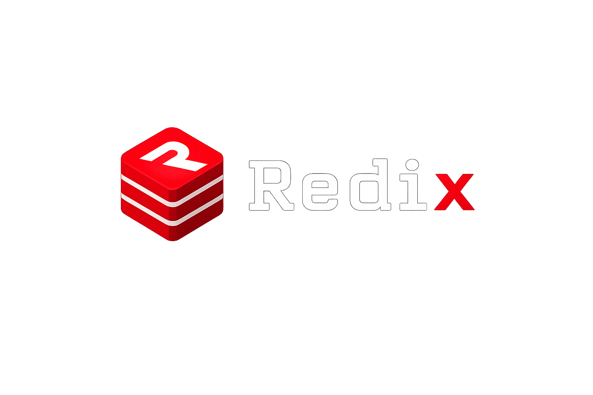
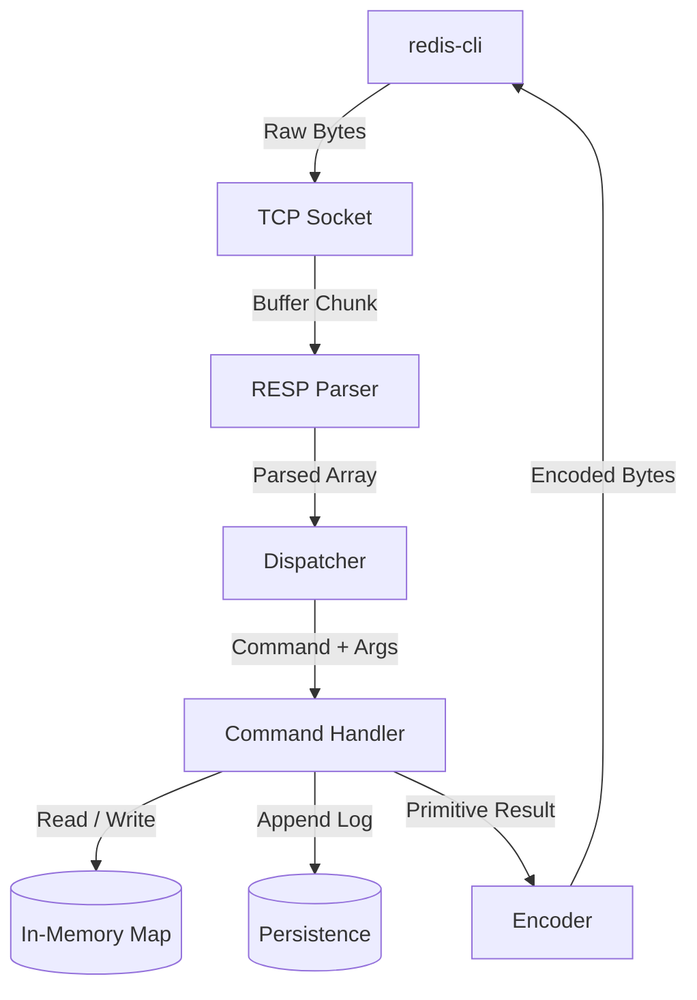
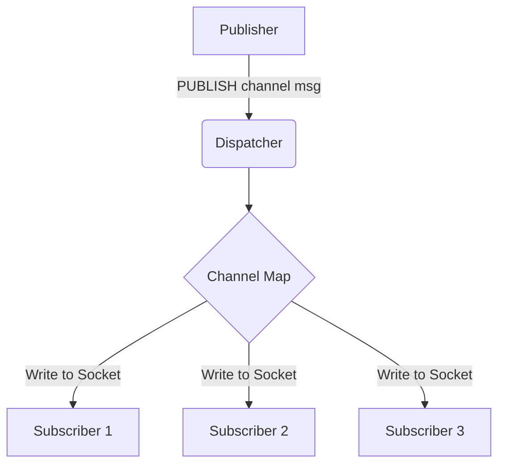

<!-- Hero Section -->
<!-- <div align="center"> -->
  <div align="center"></div>
  <p>A Redis-compatible in-memory database built from scratch in TypeScript, implementing the RESP protocol, transactions, Pub/Sub, and append-only persistence without relying on Redis internals.</p>

  <p>
    <a href="https://github.com/himanshupadecha/Redix/actions"></a>
    <a href="https://bun.sh"></a>
    <a href="https://nodejs.org"></a>
    <a href="https://www.typescriptlang.org/"></a>
    <a href="https://github.com/himanshupadecha/Redix/blob/main/LICENSE"></a>
  </p>

  <br />

<div align="center">


</div>
<!-- </div> -->

---

<h2 align="center">⚡ Feature Matrix</h2>

<div align="center">
  <table style="border: none; background: transparent;">
    <tr>
      <td valign="top" style="border: none; background: transparent;">
        <table>
          <thead>
            <tr>
              <th align="left">Core Infrastructure</th>
              <th align="center">Status</th>
            </tr>
          </thead>
          <tbody>
            <tr>
              <td align="left">RESP Protocol</td>
              <td align="center">✅</td>
            </tr>
            <tr>
              <td align="left">TCP Server</td>
              <td align="center">✅</td>
            </tr>
            <tr>
              <td align="left">AOF Persistence</td>
              <td align="center">✅</td>
            </tr>
            <tr>
              <td align="left">Transactions</td>
              <td align="center">✅</td>
            </tr>
            <tr>
              <td align="left">Pub/Sub</td>
              <td align="center">✅</td>
            </tr>
            <tr>
              <td align="left"><code>redis-cli</code></td>
              <td align="center">✅</td>
            </tr>
            <tr>
              <td align="left">RESP3</td>
              <td align="center">🚧</td>
            </tr>
            <tr>
              <td align="left">Replication</td>
              <td align="center">🚧</td>
            </tr>
          </tbody>
        </table>
      </td>
      <td width="30" style="border: none; background: transparent;"></td>
      <td valign="top" style="border: none; background: transparent;">
        <table>
          <thead>
            <tr>
              <th align="left">Data Structures</th>
              <th align="center">Status</th>
            </tr>
          </thead>
          <tbody>
            <tr>
              <td align="left">String Commands</td>
              <td align="center">✅</td>
            </tr>
            <tr>
              <td align="left">List Commands</td>
              <td align="center">✅</td>
            </tr>
            <tr>
              <td align="left">Hash Commands</td>
              <td align="center">✅</td>
            </tr>
            <tr>
              <td align="left">Set Commands</td>
              <td align="center">✅</td>
            </tr>
            <tr>
              <td align="left">Sorted Sets</td>
              <td align="center">✅</td>
            </tr>
            <tr>
              <td align="left">TTL / Expiration</td>
              <td align="center">✅</td>
            </tr>
            <tr>
              <td align="left">Clustering</td>
              <td align="center">🚧</td>
            </tr>
          </tbody>
        </table>
      </td>
    </tr>
  </table>
</div>

---

## 📖 Motivation

While many developers use Redis daily, few understand the networking and protocol parsing that make it work. This project was built to demystify database internals by reconstructing a Redis-compatible server entirely from scratch in a garbage-collected, single-threaded runtime.

> **Disclaimer:** Redix is an educational implementation created to explore systems programming and database internals. While functional and highly compliant, it does not aim to replace native Redis in production environments.

By avoiding third-party parsers and external databases, Redix serves as a foundation for understanding:

- **Raw TCP Networking:** Handling backpressure and framing unaligned byte streams.
- **Binary-Safe Protocols:** Implementing the Redis Serialization Protocol (RESP).
- **Data Persistence:** Managing durability via Append-Only Files (AOF).
- **Systems Architecture:** Building isolated transaction queues (`MULTI`/`EXEC`) and connection-aware message brokers.

---

## 🏗️ Architecture

Redix relies on the Node.js `node:net` module for event-driven, non-blocking I/O. The architecture strictly enforces a unidirectional data flow for incoming requests.

<div align="center">

</div>

### Request Lifecycle



### Pub/Sub Broadcasting

Because Pub/Sub operates outside the standard key-value paradigm, it utilizes a decoupled state machine tracking active socket references.



---

## 🚀 Quick Start

### Prerequisites

- [Bun](https://bun.sh/) (Recommended) or Node.js (v18+)
- `redis-cli` (Optional, for testing)

### Installation

```bash
# 1. Clone the repository
git clone https://github.com/your-username/redix.git
cd redix

# 2. Install dependencies
bun install

# 3. Start the server
bun run src/server.ts
```

The TCP server will bind to `127.0.0.1:6379` by default.

---

## 💻 Examples

Redix can be queried using the standard Redis CLI or any Redis client library.

```bash
redis-cli -p 6379
```

Below are examples of realistic workflows supported by the engine.

### Caching with Expiration (TTL)

```redis
# Simulating a session cache that expires after 60 seconds
127.0.0.1:6379> SET session:1042 "user_id=88" EX 60
OK
127.0.0.1:6379> GET session:1042
"user_id=88"
127.0.0.1:6379> TTL session:1042
(integer) 57
```

### Complex Data Structures (Hashes & Sets)

```redis
# Storing user profile metadata
127.0.0.1:6379> HSET user:100 name "Alice" role "admin"
(integer) 2
127.0.0.1:6379> HGETALL user:100
1) "name"
2) "Alice"
3) "role"
4) "admin"

# Tracking unique tags
127.0.0.1:6379> SADD document:tags "typescript" "database"
(integer) 2
```

### Atomic Transactions

```redis
# Executing multiple state changes atomically
127.0.0.1:6379> MULTI
OK
127.0.0.1:6379> INCR page_views
QUEUED
127.0.0.1:6379> LPUSH recent_visitors "IP:192.168.1.1"
QUEUED
127.0.0.1:6379> EXEC
1) (integer) 1
2) (integer) 1
```

### Message Broker (Pub/Sub)

Requires two isolated connections to demonstrate channel broadcasting.

```redis
# Connection A (Subscriber)
127.0.0.1:6379> SUBSCRIBE deployment_logs
Reading messages... (press Ctrl-C to quit)

# Connection B (Publisher)
127.0.0.1:6379> PUBLISH deployment_logs "Build successful."
(integer) 1

# Connection A receives the payload instantly
1) "message"
2) "deployment_logs"
3) "Build successful."
```

---

## 🛠️ Supported Commands

The server implements **30+** native Redis commands, parsed and executed with strict compatibility.

### Connection & Utility

| Command | Syntax     | Description                           |
| :------ | :--------- | :------------------------------------ |
| `PING`  | `PING`     | Tests the connection. Returns `PONG`. |
| `ECHO`  | `ECHO msg` | Returns the provided string.          |

### Keys & Expiration

| Command  | Syntax           | Description                         |
| :------- | :--------------- | :---------------------------------- |
| `DEL`    | `DEL key`        | Removes a key from memory.          |
| `EXISTS` | `EXISTS key`     | Checks if a key is present.         |
| `KEYS`   | `KEYS pattern`   | Returns matching keys.              |
| `EXPIRE` | `EXPIRE key sec` | Assigns a time-to-live to a key.    |
| `TTL`    | `TTL key`        | Returns the remaining time-to-live. |

### Strings

| Command | Syntax                 | Description                              |
| :------ | :--------------------- | :--------------------------------------- |
| `SET`   | `SET key val [EX sec]` | Stores a string. Supports `EX` argument. |
| `GET`   | `GET key`              | Retrieves a string.                      |
| `INCR`  | `INCR key`             | Increments an integer string.            |

### Lists

| Command  | Syntax                 | Description                            |
| :------- | :--------------------- | :------------------------------------- |
| `LPUSH`  | `LPUSH key val`        | Prepends a value to a list.            |
| `RPUSH`  | `RPUSH key val`        | Appends a value to a list.             |
| `LPOP`   | `LPOP key`             | Removes and returns the first element. |
| `RPOP`   | `RPOP key`             | Removes and returns the last element.  |
| `LLEN`   | `LLEN key`             | Returns the length of a list.          |
| `LRANGE` | `LRANGE key start end` | Returns a range of elements.           |

### Hashes

| Command   | Syntax               | Description                      |
| :-------- | :------------------- | :------------------------------- |
| `HSET`    | `HSET key field val` | Sets a field in a hash map.      |
| `HGET`    | `HGET key field`     | Gets a field from a hash map.    |
| `HDEL`    | `HDEL key field`     | Deletes a field from a hash map. |
| `HEXISTS` | `HEXISTS key field`  | Checks if a hash field exists.   |
| `HGETALL` | `HGETALL key`        | Returns all fields and values.   |

### Sets & Sorted Sets

| Command     | Syntax                 | Description                         |
| :---------- | :--------------------- | :---------------------------------- |
| `SADD`      | `SADD key val`         | Adds a member to a Set.             |
| `SREM`      | `SREM key val`         | Removes a member from a Set.        |
| `SISMEMBER` | `SISMEMBER key val`    | Checks Set membership.              |
| `SMEMBERS`  | `SMEMBERS key`         | Returns all members in a Set.       |
| `SCARD`     | `SCARD key`            | Returns Set cardinality.            |
| `ZADD`      | `ZADD key score mem`   | Adds a member to a Sorted Set.      |
| `ZSCORE`    | `ZSCORE key mem`       | Returns a member's score.           |
| `ZCARD`     | `ZCARD key`            | Returns Sorted Set cardinality.     |
| `ZREM`      | `ZREM key mem`         | Removes a member from a Sorted Set. |
| `ZRANGE`    | `ZRANGE key start end` | Returns a range of members.         |

### Transactions

| Command   | Syntax    | Description                   |
| :-------- | :-------- | :---------------------------- |
| `MULTI`   | `MULTI`   | Begins a transaction block.   |
| `EXEC`    | `EXEC`    | Executes all queued commands. |
| `DISCARD` | `DISCARD` | Flushes all queued commands.  |

### Pub/Sub

| Command       | Syntax             | Description                        |
| :------------ | :----------------- | :--------------------------------- |
| `SUBSCRIBE`   | `SUBSCRIBE chan`   | Listens for messages on a channel. |
| `PUBLISH`     | `PUBLISH chan msg` | Posts a message to a channel.      |
| `UNSUBSCRIBE` | `UNSUBSCRIBE chan` | Stops listening to a channel.      |

---

## 🧠 Design Decisions

Building a stateful infrastructure service in Node.js presents unique constraints. Here is why specific architectural patterns were chosen:

### Extending `net.Socket` for Transaction State

Instead of maintaining a global map of active transactions (which introduces concurrency edge cases), the native `node:net` `Socket` is extended into a custom `RedisSocket` type. Attaching `inTransaction` and `commandQueue` properties directly to the socket ensures that transaction state is strictly isolated to that specific TCP connection.

### Using `Map` for the Storage Engine

The core database relies on a global `Map` rather than a standard JS Object. `Map` avoids prototype chain pollution (preventing malicious key collisions like `__proto__`) and provides guaranteed average O(1) time complexity for insertions and lookups, critical for database operations.

### Single-Threaded Transaction Execution

Redix leverages the synchronous nature of the V8 JavaScript engine. When a client calls `EXEC`, the server loops through the queued commands sequentially. Because the Node event loop will not pause to handle network packets from other sockets while executing a synchronous `for` loop, the transaction block achieves implicit atomicity and isolation without requiring complex mutex locks.

### Tracking Subscriptions via `Set<Socket>`

Pub/Sub channels are mapped to a `Set` of `RedisSocket` references. This allows O(1) removals when a client disconnects. More importantly, storing direct socket references allows the `PUBLISH` command to iterate over the set and write to multiple clients rapidly without maintaining lookup tables of connection IDs.

### Append-Only File (AOF) over Binary Snapshots

For an in-memory Node.js application, binary snapshotting (RDB) requires complex memory traversal and serialization that severely blocks the event loop. Redix utilizes an Append-Only File (AOF) approach—streaming mutating commands as raw strings to a disk log. During server boot, the engine reconstructs its state by re-executing this ledger, offering reliable crash recovery.

---

## ⚙️ Implementation & Folder Structure

The repository is modularized to separate protocol parsing from command execution and storage mechanics.

```text
src/
├── commands/
│   # Contains the implementation of every Redis command.
│   # Why? Decouples command execution logic from protocol parsing and routing.
│
├── core/
│   # Contains the RESP protocol serialization (encoder.ts) and deserialization (decoder.ts).
│   # Why? Abstracting the parser allows the dispatcher to operate on native arrays instead of byte buffers.
│
├── persistence/
│   # Contains Disk I/O logic for the Append-Only File (AOF).
│   # Why? Isolates durability mechanisms and startup state reconstruction (`populateOldDataInAOF`).
│
├── tests/
│   # Contains unit and integration test suites.
│   # Why? Verifies command behavior and byte-level parser accuracy.
│
├── dispatcher.ts
│   # Routes parsed RESP arrays to specific command handlers.
│   # Why? Centralizes request validation and intercepts queued transaction commands.
│
├── memory.ts
│   # Initializes the singleton in-memory database map.
│   # Why? Acts as the single source of truth for the primary key-value store.
│
├── pub-sub-memory.ts
│   # Tracks socket state for active channel subscriptions.
│   # Why? Keeps volatile connection state entirely separate from persistent data structures.
│
└── server.ts
    # Initializes the TCP server and connection lifecycle.
    # Why? Binds the `node:net` listener and pipes raw network streams to the parser.
```

---

## 📚 Database Internals Documentation

For deep technical dives into the codebase, refer to the internal documentation. These files are written specifically to explain the underlying mechanics of protocol parsing and state management.

- [**System Architecture**](./docs/ARCHITECTURE.md)
- [**RESP Protocol Implementation**](./docs/RESP.md)
- [**AOF Persistence**](./docs/PERSISTENCE.md)
- [**Transactions**](./docs/TRANSACTIONS.md)
- [**Pub/Sub Engine**](./docs/PUBSUB.md)
- [**Data Structures**](./docs/DATA_STRUCTURES.md)

---

## 🗺️ Roadmap

While the core primitive operations are functional, several advanced features are planned:

- [ ] **TypeScript SDK:** Create a strictly-typed client library optimized for Redix.
- [ ] **RESP3 Support:** Upgrade the parser to handle RESP3 maps, sets, and out-of-band attributes.
- [ ] **Pipelining:** Optimize the dispatcher and TCP write buffers to handle batched requests more efficiently.
- [ ] **AOF Rewriting:** Implement background compaction of the `data.aof` file to prevent unbounded disk growth.
- [ ] **Replication:** Introduce leader-follower replication via asynchronous command forwarding.
- [ ] **Cluster Support:** Implement consistent hashing for data sharding across multiple instances.
- [ ] **Lua Scripting:** Integrate a Lua runtime to execute complex atomic scripts server-side.
- [ ] **Benchmark Suite:** Establish formal load-testing using `redis-benchmark` in CI/CD.

---

## 🤝 Contributing

Contributions are welcome from developers interested in database internals or network programming.

1. Fork the repository.
2. Create a feature branch: `git checkout -b feature/new-command`.
3. Ensure strict typing and write tests for your command.
4. Submit a Pull Request outlining your changes.

---

## 🙏 Acknowledgements

Inspired by:

- [Redis](https://redis.io/)
- [RESP Specification](https://redis.io/docs/reference/protocol-spec/)
- Node.js `node:net` module

This project is an independent implementation created for learning purposes and does not include Redis source code.

---

## 📜 License

Distributed under the MIT License. See `LICENSE` for more information.
