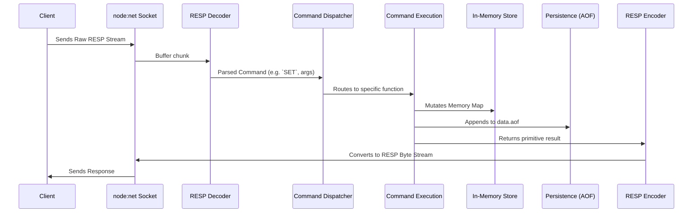

# System Architecture

This document provides a deep dive into the architecture of the custom Redis-compatible server. The server is built entirely in TypeScript, avoiding external dependencies for core database functionalities.

## High-Level Request Flow

At a macroscopic level, the server acts as an event-driven TCP server. Every incoming byte stream from a client undergoes a strict pipeline:



---

## 1. Networking (`src/server.ts`)

The networking layer is implemented using the standard Node.js `node:net` module, capitalizing on its non-blocking, event-driven I/O model.

### TCP Initialization
The entry point `net.createServer()` establishes a listening TCP socket on port `6379`.
When a client connects:
- An isolated `pendingBuffer` (of type `Buffer`) is instantiated per client.
- A custom `RedisSocket` interface (extending standard `Socket`) tracks transaction state (`inTransaction` boolean and `commandQueue` array).

### Data Accumulation
Because TCP is a streaming protocol, incoming payloads are not guaranteed to align with complete RESP messages. The server concatenates incoming chunks:

```typescript
pendingBuffer = Buffer.concat([pendingBuffer, dataBuffer]);
```

It repeatedly attempts to parse the `pendingBuffer`. If parsing succeeds, it advances the buffer window by `charsprocessed`. If a message is incomplete, parsing aborts, waiting for the next `data` event.

---

## 2. Parsing Layer (RESP)

The parsing layer sits between raw bytes and command execution.

### Decoder (`src/core/decoder.ts`)
The decoder converts raw byte streams into an AST-like string array. It understands the RESP `\r\n` (CRLF) delimited structure, iterating cursor positions to extract array lengths and bulk string payloads.

### Encoder (`src/core/encoder.ts`)
The encoder is structured as an Object-Oriented class `Encoder` implementing `BaseEncoder`. It takes primitive TypeScript types (strings, numbers, arrays) returned by command handlers and serializes them into strict RESP format before writing them back to the TCP socket.

*(For detailed byte layouts, see [RESP Implementation](./RESP.md))*

---

## 3. Command Dispatcher (`src/dispatcher.ts`)

The Command Dispatcher is the central nervous system. Once a command is parsed into a `[Command, ...args]` array, it is passed to the dispatcher.

### Responsibilities:
1. **Transaction Interception**: If the socket is marked as `inTransaction = true` (and the command isn't `EXEC` or `DISCARD`), the dispatcher halts execution, pushes the command into the `socket.commandQueue`, and returns `+QUEUED\r\n`.
2. **Routing**: A massive `switch/case` block maps string commands (e.g., `"set"`) to their isolated implementations in the `src/commands/` directory.
3. **Validation**: Handles preliminary argument length validation (e.g., for `echo`).
4. **Fallback**: Returns `-ERR unknown command\r\n` for unsupported operations.

---

## 4. Execution & Storage (`src/commands/`, `src/memory.ts`)

Commands are separated into granular modules inside `src/commands/`.

### Storage Map
State is retained in a singleton Javascript `Map` located in `src/memory.ts`.

```typescript
const memory = new Map<string, {
    value: 
      | { type: "string"; value: string }
      | { type: "list"; value: string[] }
      | { type: "hash"; value: Record<string, string> }
      | { type: "set"; value: Set<string> }
      | { type: "zset"; value: zsetObject[] };
    expiresAt?: number;
}>();
```

### Command Execution
A command implementation, like `set.ts`, performs the following:
1. Validates specific arguments (e.g., checking `EX` flag for expirations).
2. Computes TTL if needed.
3. Mutates the `memory` Map.
4. Triggers `writeCommandInAOF` to persist the change.
5. Returns a primitive result to the `Encoder`.

---

## 5. Subsystems

### Persistence (AOF)
Mutating commands write directly to an Append-Only File (`data.aof`). On server boot (`server.ts:7`), `populateOldDataInAOF()` synchronously reads this ledger and reconstructs the `memory` Map before accepting TCP connections.
*(Detailed in [PERSISTENCE.md](./PERSISTENCE.md))*

### Transactions
Leveraging the synchronous nature of Node's event loop and the custom `RedisSocket` context, transactions guarantee that a queued sequence of commands executes atomically during the `EXEC` call without interleaving operations from other clients.
*(Detailed in [TRANSACTIONS.md](./TRANSACTIONS.md))*

### Pub/Sub
Pub/Sub state lives in `src/pub-sub-memory.ts`, separate from the primary data map. It maintains a mapping of `Channel -> Set<RedisSocket>`. `PUBLISH` iterates over the relevant Set, writing directly to the connected sockets.
*(Detailed in [PUBSUB.md](./PUBSUB.md))*
